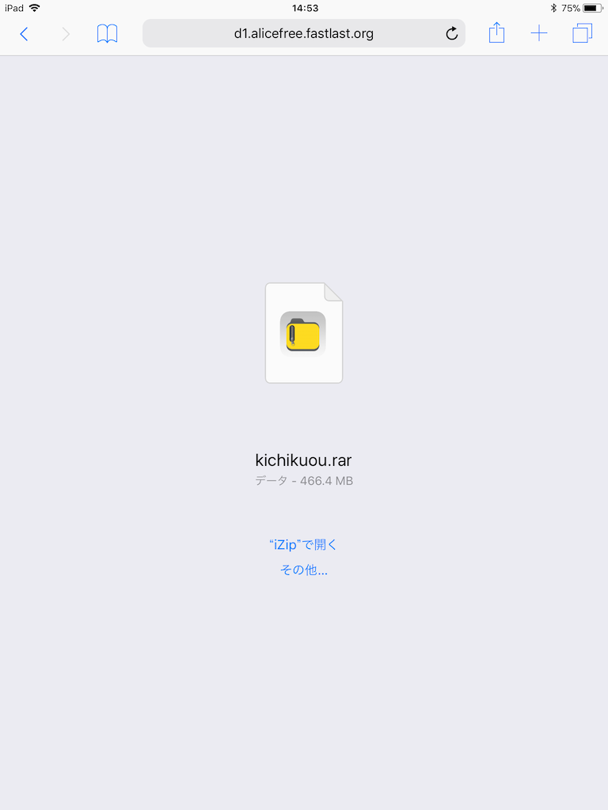
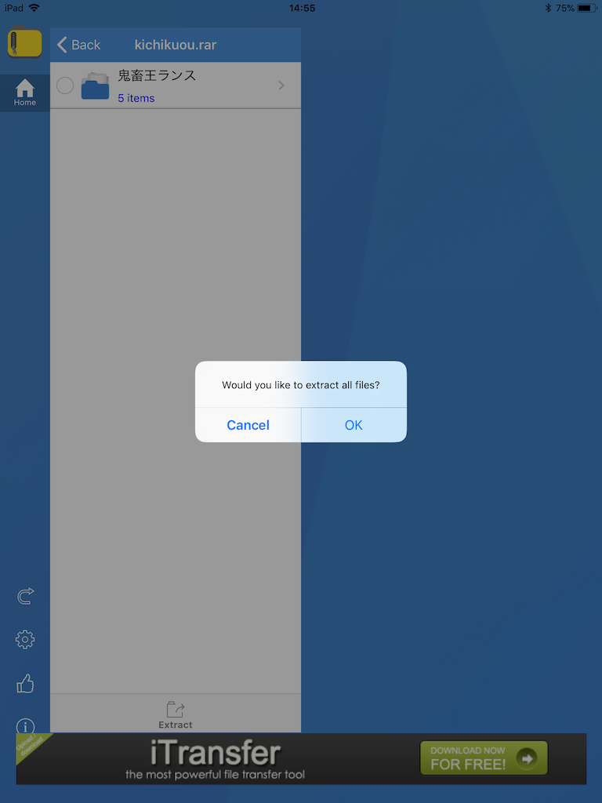
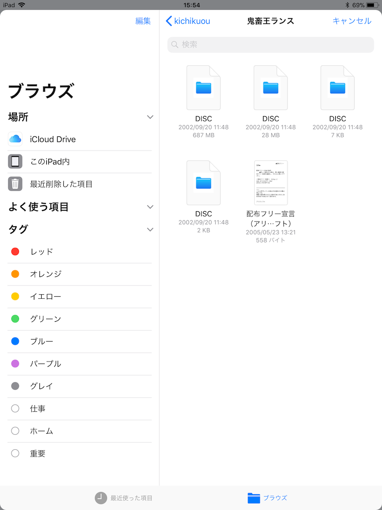

# ゲームを起動する

本サイトは実行環境のみを提供しており、ゲームのプレイにはCD-ROMイメージやZIPファイルを読み込む必要があります。

## 起動手順

まず、起動したいゲームのディスクイメージをダウンロードします。入手先については、[対応ゲーム](games.md) を参照してください。

- **「RARファイル（CDイメージ）」**をダウンロードした場合:
    1. RAR圧縮ファイルを展開して、CD-ROMイメージを取り出します。
        - 推奨展開ツール:
            - Windows: [LhaPlus](http://www.forest.impress.co.jp/library/software/lhaplus/)
            - macOS: [The Unarchiver](https://itunes.apple.com/jp/app/the-unarchiver/id425424353)
            - Android: [ZArchiver](https://play.google.com/store/apps/details?id=ru.zdevs.zarchiver&hl=ja)
    2. 展開したフォルダー内にある以下のファイルを読み込みます:
        - 拡張子 `.img` または `.mdf` のファイル
        - 拡張子 `.cue` または `.ccd` または `.mds` のファイル

        鬼畜王 on Web のページにドラッグ＆ドロップするか、ページにある「ファイルを選択」ボタンを押して選択します。
        どれを選べばよいか迷った場合は、フォルダー内のすべてのファイルをまとめて読み込ませても問題ありません。

- **「ZIPファイル（Windows版アーカイブ）」**をダウンロードした場合:

    ダウンロードしたZIPファイルをそのまま 鬼畜王 on Web のページにドラッグ＆ドロップするか、「ファイルを選択」ボタンから読み込んでください。

ゲームが読み込まれると、自動的に起動します。
セーブデータはブラウザ内に保存されるため、次回プレイ時も同じCDイメージまたはZIPファイルを読み込ませれば、前回の続きから再開できます。

## iOSでの起動方法

iOS / iPadOS で、RARファイルからCD-ROMイメージを取り出してゲームを起動する方法を説明します。

なお、ZIPファイルから起動する場合（ランス1〜3、闘神都市1など）の場合は、ダウンロードしたZIPファイルをそのまま読み込ませるだけでOKです。詳しくは、上記の [起動手順](#起動手順) をご参照ください。

以下のスクリーンショットは iPad のものですが、iPhone でも手順は同様です。

1. 「設定」→「一般」→「iPhoneストレージ」から、空き容量を確認してください。1.4GB以上の空きが必要です。
2. Rar圧縮ファイルの解凍に使用するため、App Store から [iZip](https://itunes.apple.com/jp/app/izip-zip%E5%9C%A7%E7%B8%AE-zip%E8%A7%A3%E5%87%8D-rar%E8%A7%A3%E5%87%8D%E3%81%AE%E3%81%9F%E3%82%81%E3%81%AE%E3%83%84%E3%83%BC%E3%83%AB/id413971331?mt=8) をインストールします。
3. [配布サイト](https://alicefree.fastlast.org/)からCDイメージをダウンロードします。ファイルサイズが数百MBになるため、Wi-Fi環境でのダウンロードを推奨します。ダウンロードリンクをタップしてからしばらく時間がかかりますが、そのままお待ち下さい。
4. ダウンロードが完了するとこのような画面になります。「"iZip"で開く」をタップします。 
5. すべてのファイルを解凍するか聞かれます。「OK」をタップすると解凍が始まります。こちらも数分程度かかる場合があります。 
6. Safariに戻り、鬼畜王 on Web のページで「ファイルを選択」ボタンを押して、「ファイルを選択」→「このiPhone内」→「iZip」の中から、ディスクイメージファイルを探して開きます。拡張子が表示されないため全て同じ名前に見えますが、600MB台のファイルが `.img` 、1～2KB のファイルが `.cue` です。 
7. `.img` と `.cue` の両方が開かれると、ゲームが起動します。
8. ダウンロードした `.rar` ファイルはもう不要なので、iZip またはiOS標準の「ファイル」アプリから削除しておきましょう。
